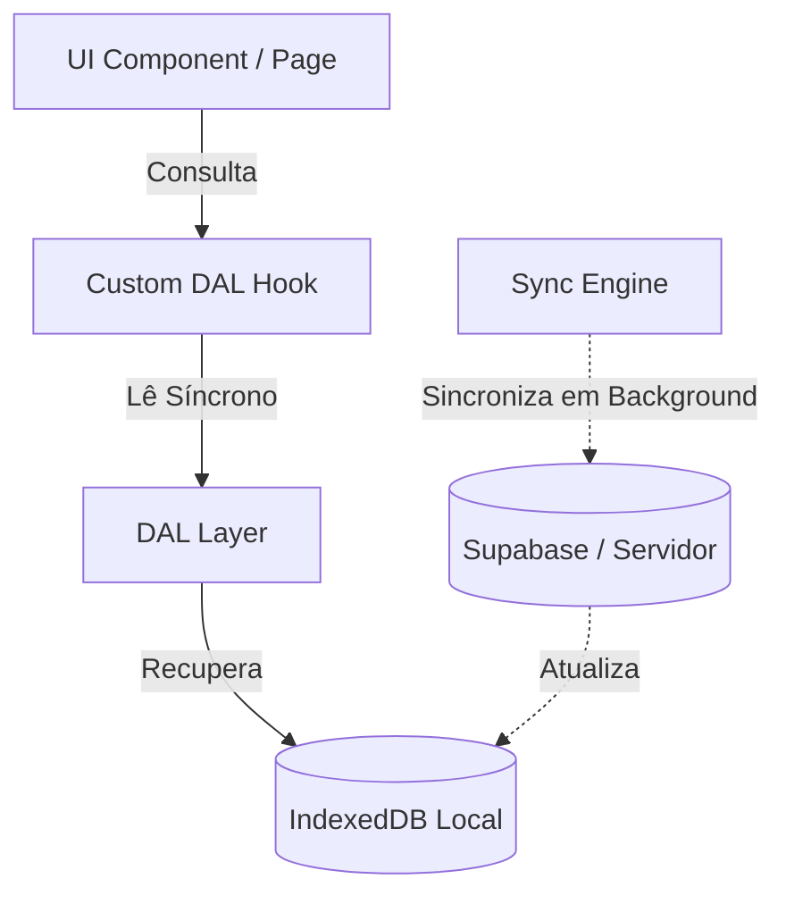
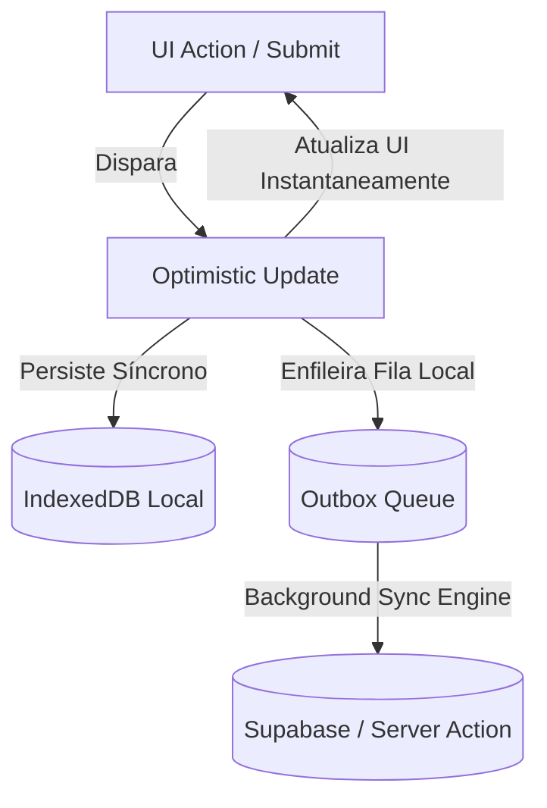

# RepTrail Local-First Architecture Rule (Mandatory)

> **PRIORIDADE MÁXIMA.** Todas as skills, agentes e tasks do RepTrail devem obedecer rigorosamente a este documento.
> Em caso de conflito com qualquer task, **esta regra prevalece sobre o código e designs legados**.
> Qualquer descumprimento desta regra é tratado como **erro arquitetural grave de impedimento (hard block)**.

---

## Objetivo e Princípio Fundamental

RepTrail é um sistema **Local-First (Offline-First)** por design.
A experiência do usuário (leitura, escrita e navegação) deve continuar funcionando integralmente **mesmo sem conexão com a internet**.

A rede é considerada meramente uma camada de sincronização em segundo plano, e **nunca** a fonte primária de leitura ou bloqueio de ações durante a renderização da UI.

---

## Fonte de Verdade

### 1. Fluxo de Leitura (Leitura Local-First)
A UI **nunca** deve depender diretamente de chamadas de rede para renderizar informações. É estritamente proibido o uso direto de:
- Clientes Supabase (`@supabase/*`)
- Server Actions (`@/actions/*`)
- RPCs ou APIs Externas
- `fetch()` ou `axios`

Toda leitura de dados deve ocorrer exclusivamente através da **DAL (Data Abstraction Layer)**.

**Fluxo de Leitura Obrigatório:**


*Toda renderização na tela deve ocorrer com base nos dados presentes no banco local de baixa latência.*

---

### 2. Fluxo de Escrita (Escrita Otimista)
Toda alteração de estado (criação, edição, exclusão) iniciada na interface deve ser refletida de forma **síncrona, instantânea e otimista** no banco local e na UI.

**É expressamente proibido bloquear a interface do usuário aguardando respostas de rede.**

**Fluxo de Escrita Obrigatório:**


---

## Proibições Absolutas & Governança

### 1. Bloqueio de Server Actions na UI
É terminantemente proibido importar funções do diretório `@/actions/*` em:
- `src/app/` (pages de rotas dinâmicas do cliente)
- `src/components/store/sections/`
- `src/components/store/advanced/`
- `src/components/store/intermediary/`
- `src/hooks/` (hooks customizados de UI/apresentação)

*Exemplo de importação proibida:*
```typescript
// ❌ PROIBIDO NA UI
import { updateWorkout } from '@/actions/workout-actions'
```

---

### 2. Bloqueio de Acesso Direto ao Supabase
É expressamente proibida a instanciação e uso direto do cliente do Supabase:
- `supabase.from(...)`
- `supabase.rpc(...)`
- `supabase.channel(...)`
- `supabase.auth(...)` (exceto em fluxos estritos de login/registro inicial)

em `page.tsx`, componentes de UI, hooks de apresentação, sections, advanced ou intermediary.

> [!IMPORTANT]  
> O cliente e tipos do Supabase devem residir e ser acessados **exclusivamente** dentro de:
> - `src/lib/dal/`
> - `src/lib/supabase/` (apenas wrappers fundamentais)
> - `src/lib/sync-engine.ts` ou arquivos de background-sync.

---

### 3. Bloqueio de Requisições HTTP Diretas
É proibido chamar bibliotecas de rede cliente diretamente nas camadas de UI fora da DAL:
- `fetch(...)`
- `axios(...)`
- `ky(...)`
- `graphql(...)`

---

### 4. Governança de WebSockets / Realtime
A escuta de eventos do banco de dados remoto (realtime postgres changes) não pode ser acoplada ou gerenciada diretamente por componentes React de UI.

*Exemplo de acoplamento proibido:*
```typescript
// ❌ PROIBIDO DENTRO DE COMPONENTES DE UI
useEffect(() => {
  const channel = supabase.channel('table-sync').on('postgres_changes', ...).subscribe()
  return () => { supabase.removeChannel(channel) }
}, [])
```

**Fluxo de Eventos Realtime Obrigatório:**
```
[Supabase Realtime] 
       ↓
[Sync Engine Global]
       ↓
[IndexedDB Update]
       ↓
[React Query Observers / DAL]
       ↓
[UI Renderizada]
```

---

## Estrutura Obrigatória da DAL (Data Abstraction Layer)

Cada entidade ou módulo do sistema deve possuir uma pasta correspondente sob `src/lib/dal/` contendo a seguinte especificação mínima:

```
src/lib/dal/
 ├── workouts/
 ├── athletes/
 ├── exercises/
 ├── programs/
 └── [entidade]/
```

Cada módulo deve obrigatoriamente exportar a interface pública de manipulação local e sincronia em segundo plano:
- `get(id)` (leitura única local)
- `list()` (leitura de coleções locais)
- `create(payload)` (gravação no IndexedDB e enfileiramento Outbox)
- `update(id, payload)` (atualização local e enfileiramento Outbox)
- `remove(id)` (remoção síncrona local e enfileiramento Outbox)
- `sync()` (gatilho de revalidação/sincronia do módulo)

---

## Persistência & Outbox Obrigatórios

1. **IndexedDB Local:** Toda entidade persistente deve ser espelhada localmente. É proibido estruturar fluxos de dados onde informações só existam no servidor ou que desapareçam completamente ao entrar em modo offline.
2. **Outbox Queue:** Toda escrita/mutation local deve obrigatoriamente gerar uma chamada síncrona ao banco de persistência da fila:
   ```typescript
   await outboxDB.enqueue({
       id: crypto.randomUUID(),
       actionName: 'updateWorkout',
       entity: 'workouts',
       payload: variables
   })
   ```
   antes de qualquer gatilho de sincronização HTTP em background.

---

## Skills de Refatoração Local-First (Passo a Passo)

Qualquer refatoração orientada a tornar uma funcionalidade offline-first deve seguir rigorosamente estes 6 passos, executando as respectivas skills:

### Passo 1: `localfirst-audit`
- **Objetivo:** Localizar estaticamente queries diretas, mutations Supabase na UI, imports proibidos de Server Actions e escutas de websockets acoplados nos componentes.

### Passo 2: `localfirst-classify`
- **Objetivo:** Classificar a severidade das violações encontradas, identificar dependências cruzadas entre componentes e definir a melhor estratégia de migração local.

### Passo 3: `localfirst-create-dal`
- **Objetivo:** Criar e declarar a camada de DAL necessária para o módulo, configurando as stores do IndexedDB local, adapters e repositórios locais.

### Passo 4: `localfirst-fix-mutations`
- **Objetivo:** Migrar todas as submissões de escrita para IndexedDB, aplicando optimistic updates síncronos e enfileiramento no OutboxDB.

### Passo 5: `localfirst-fix-queries`
- **Objetivo:** Alterar todas as leituras de tela para consumir exclusivamente os hooks da DAL baseados em IndexedDB-first, ativando sincronização transparente no background.

### Passo 6: `localfirst-zero-drift`
- **Objetivo:** Validar que absolutamente nenhuma alteração visual, de espaçamento, alinhamento ou comportamento do Design System ocorreu na UI após a refatoração sob o capô.

---

## Zero Visual Drift

> [!CAUTION]  
> A migração para a arquitetura Local-First é uma alteração estritamente estrutural e de fluxo de dados. **Nenhum detalhe visual deve ser alterado ou quebrado.**

- **Mudanças Permitidas:**
  - ✅ Camada de acesso a dados (DAL)
  - ✅ Fluxo de mutations e queries (IndexedDB / React Query)
  - ✅ Fila de persistência temporária (Outbox)
  - ✅ Mecanismo de sincronização em segundo plano

- **Mudanças Estritamente Proibidas:**
  - ❌ JSX ou estrutura de tags visuais do componente
  - ❌ Arquivos CSS, classes Tailwind ou Inline Styles
  - ❌ Tokens de design (`STORE_TOKENS`)
  - ❌ Dimensões, gaps, padding ou fontes estabelecidas no Design System

---

## Critérios de Rejeição Automática (Checklist de Code Review)

Qualquer código enviado em Pull Requests deve ser sumariamente rejeitado se violar qualquer um dos pontos abaixo:
- [ ] Presença de `@/actions/*` ou imports dinâmicos de actions dentro das pastas de UI (`components/store`, `hooks`, `app`).
- [ ] Qualquer query direta (`supabase.from(...).select(...)`) na camada cliente de UI ou componentes React.
- [ ] Qualquer mutation direta (`supabase.from(...).insert()/update()/delete()`) na camada de UI.
- [ ] Uso direto de `fetch()`, `axios` ou clientes HTTP no cliente fora da pasta `src/lib/dal`.
- [ ] Escutas manuais de WebSockets (`supabase.channel().subscribe()`) implementadas em useEffects na UI.
- [ ] Atualização de dados que trave a interface exibindo um "spinner" de bloqueio aguardando resposta de rede.
- [ ] Quebra visual, desalinhamento de grid, ou alteração de tokens de margens/gaps durante a refatoração.
